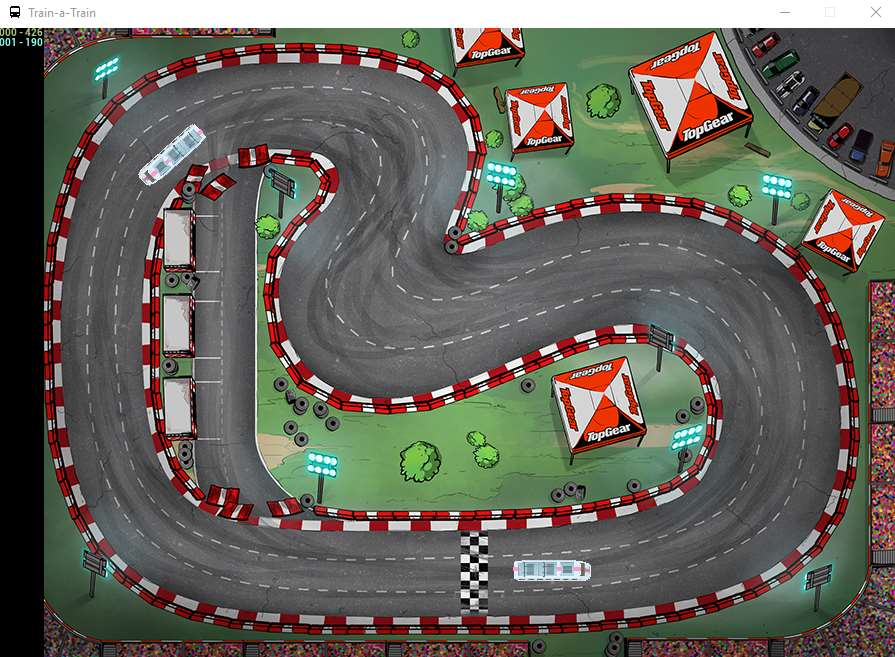

Train-a-Train
====================================================

.. image:: https://readthedocs.org/projects/train-a-train/badge/?version=latest
   :target: https://train-a-train.readthedocs.io/en/latest/?badge=latest
   :alt: Documentation Status

.. image::  https://img.shields.io/pypi/l/pydiagnostics.svg?color=brightgreen
   :target: https://github.com/tim00w/diagnostics/blob/master/LICENSE
   :alt: License: MIT

**Train-a-Train** is a 2D train racing game made for demonstrating the simplest of AI applications. To use as in a workshop please check the *workshop* section in the documentation (see below).

Feel free to contact me on LinkedIn for questions or your high score!

This project was initially used for a workshop at ProRail, the Dutch rail infrastructure company. This explains the train ;)

Documentation
-------------

Documentation to be found on `ReadTheDocs <https://train-a-train.readthedocs.io/en/latest/>`_.

